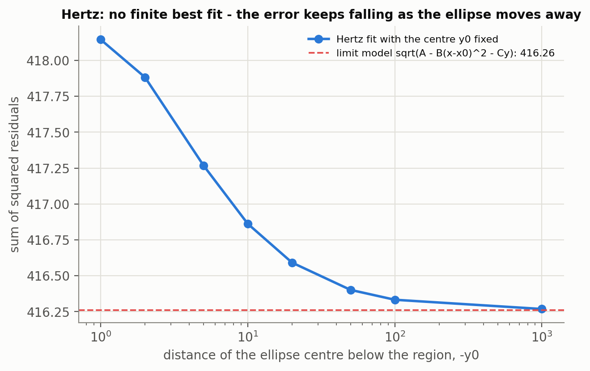
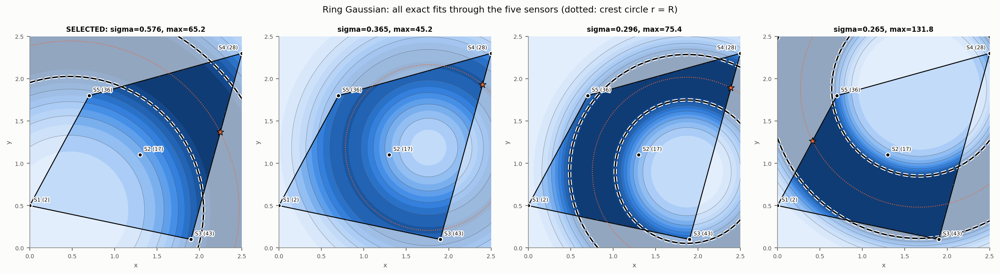
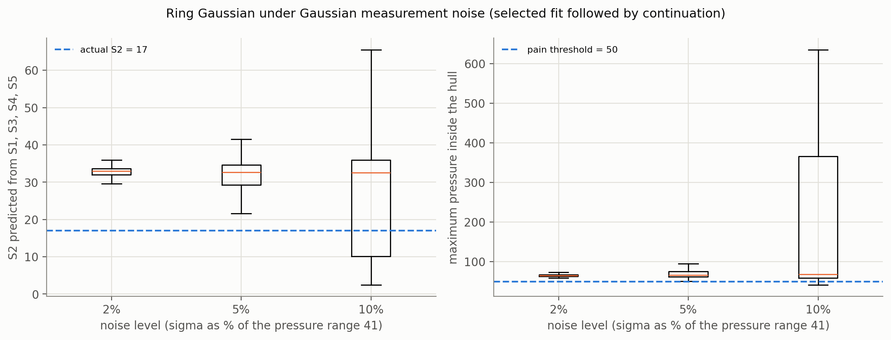

# Physical contact models: from Hertz contact to a ring-shaped pressure distribution

This part asks whether a *physically motivated* contact model can explain the five measurements. We
first test the classical
Hertz contact model and show that no model of this type can reproduce the data (Section 1). The way it
fails points to a pressure distribution that is low in the middle and high around it, which leads to the
ring-shaped Gaussian contact model analysed in Sections 2–8.

All numerical methods in this part (Levenberg–Marquardt, bisection, Newton–Raphson, parabolic
interpolation, multidimensional Newton, projected steepest ascent) are our own implementations. scipy is
only used to cross-check results and, in one place, for an equality-constrained optimisation (Section 2).
The code is in `run_contact.py`, `models.py` and `numerics/`; all tables are in `results/`.

---

## 1 Hertz contact as a starting point

### 1.1 Model

For an elastic body pressed onto a flat surface, Hertz theory gives an elliptical contact patch with

$$p(x,y) = p_0\sqrt{\max\Big(0,\;1-\Big(\tfrac{x-x_0}{a}\Big)^2-\Big(\tfrac{y-y_0}{b}\Big)^2\Big)}$$

where $p_0$ is the peak pressure at the centre $(x_0, y_0)$ and $a, b$ are the semi-axes. The pressure is
zero on and outside the contact ellipse. Because every sensor measured a positive pressure, all five
sensors must lie inside the ellipse. The five parameters were fitted by nonlinear least squares, i.e. by
minimising $S(\theta)=\sum_i (p(x_i,y_i;\theta)-p_i)^2$. The inside-the-ellipse constraint was imposed by penalty terms.

### 1.2 Fitting with Levenberg–Marquardt

Each Levenberg–Marquardt step solves

$$(J^TJ+\mu\,\mathrm{diag}(J^TJ))\,\delta = -J^Tr$$

using the analytic Jacobian of the residuals. The damping parameter $\mu$ is reduced after a successful
step and increased after a failed one. Parameters that reach a bound and are pushed further outward by the
gradient are frozen for that step (active set). We ran the solver from 100 random starting points (fixed seed).

**Table 1 Hertz fit (five sensors)**

| Solver | p0 | x0 | y0 | a | b | SSE | runs reaching the best SSE |
|---|---|---|---|---|---|---|---|
| Levenberg–Marquardt (own) | 35.06 | 1.731 | **−5.00 (bound)** | 1.790 | 22.38 | 417.27 | 100 % |
| scipy trust-region (check) | 35.06 | 1.731 | −5.00 (bound) | 1.790 | 22.38 | 417.27 | 87 % |

Both solvers reach the same optimum. (The analytic Jacobian is zero for a sensor outside the ellipse,
where p = 0 whatever the parameters are. Before this was imposed, only about half of the starts reached
the best SSE.) The fitted pressures at S1–S5 are 2.19, 32.66, 33.98, 29.52 and 26.60,
compared with the measured 2, 17, 43, 28 and 36 (RMSE 9.14). **The Hertz model cannot pass through the
data.**

### 1.3 Why no Hertz surface can fit: a concavity argument

Inside the contact ellipse, $p = p_0\sqrt{1-q}$ with $q$ a convex quadratic, so $p$ is a **concave**
function. For a concave function, the value at a point inside the convex hull of other points is at least
any convex combination of the values there. S2 lies inside the hull of S1, S3, S4 and S5. We therefore
solved the linear programme

$$\min_{w\ge 0}\ \sum_k w_k p_k \quad\text{s.t.}\quad \sum_k w_k (x_k, y_k) = (x_{S2}, y_{S2}),\ \ \sum_k w_k = 1.$$

Its minimum is **19.56** (weights S1 0.434, S3 0.190, S4 0.376). Hence **every** concave surface through
S1, S3, S4 and S5 has $p(S2)\ge 19.56$, whereas the measured value is 17. This rules out not only Hertz but
any single-peaked, concave contact model. The data require the pressure at S2 to be *lower* than a smooth
dome through the surrounding sensors would allow.

### 1.4 The least-squares problem has no finite solution

The optimiser stops with the ellipse centre on its bound ($y_0=-5$), with a very long semi-axis $b$. To
test whether this is merely a consequence of the chosen bound, we fixed $y_0$ at increasingly distant
values and refitted the remaining parameters (Table 2, Fig. 1).

**Table 2 Hertz fit with the centre height fixed**

| y0 | −1 | −2 | −5 | −10 | −20 | −50 | −100 | −1000 |
|---|---|---|---|---|---|---|---|---|
| SSE | 418.14 | 417.88 | 417.27 | 416.86 | 416.59 | 416.40 | 416.33 | 416.27 |
| b | 34.7 | 20.8 | 22.4 | 28.7 | 40.7 | 73.3 | 124.8 | 1026.8 |

All eight fits converge with every sensor inside the ellipse. The error keeps decreasing as the ellipse moves away. Expanding the model for $y_0\to-\infty$,
$b\to\infty$ gives the four-parameter limit

$$p = \sqrt{A - B(x-x_0)^2 - C\,y},$$

which reaches SSE = **416.26**, lower than any finite Hertz ellipse. The Hertz least-squares problem
therefore has **no minimiser**: its infimum is attained only by an "infinitely large" contact patch. The
parameters $y_0$ and $b$ are not identifiable from the data.

*Figure 1 Sum of squared residuals of the Hertz fit versus the fixed centre height.*

**Structural consequence for (b).** The constraint places all sensors inside the ellipse. Since an ellipse
is convex, the whole convex hull then lies inside it, so a constrained Hertz fit **can never predict
$p=0$ inside the hull**. Its minimum over the hull is at a hull vertex (2.19 at S1).

**Conclusion of 4.1.** The Hertz model fails for a structural reason, not a numerical one. Any concave
contact model is incompatible with the low pressure measured at S2. This motivates a model whose pressure
is low in the middle and high around it.

---

## 2 Ring-shaped Gaussian contact model

### 2.1 Model

A pressure that concentrates on a ring can arise, for example, when a curved or hollow object is held so
that the load is carried near the rim of the contact. We describe it by

$$p(x,y) = A\,\exp\!\Big(-\frac{(r-R)^2}{2\sigma^2}\Big),\qquad r=\sqrt{(x-x_0)^2+(y-y_0)^2},$$

with crest height $A$, ring centre $(x_0,y_0)$, ring radius $R$ and ring width $\sigma$. The pressure is
highest on the crest circle $r=R$ and decays towards the centre and far away. We set the offset to zero
(pressure vanishes far from the contact), which gives five parameters for five measurements.

### 2.2 All exact fits

Five nonlinear equations in five unknowns can have several isolated solutions. We therefore ran
Levenberg–Marquardt from 2000 random starts (analytic Jacobian). 369 runs reproduced the data exactly
(SSE < 1e−10), and they fall into **four distinct solutions** (Table 3, Fig. 2).

**Table 3 Exact ring fits through the five sensors**

| | A | centre (x0, y0) | R | σ | found (of 2000) | max in hull | min in hull |
|---|---|---|---|---|---|---|---|
| **1 (selected)** | 65.20 | (0.473, 0.451) | 1.995 | **0.576** | 310 | **65.20** | 0.161 |
| 2 | 45.23 | (1.761, 1.186) | 0.979 | 0.365 | 42 | 45.23 | 1.230 |
| 3 | 75.38 | (1.872, 0.902) | 1.116 | 0.296 | 7 | 75.38 | 0.062 |
| 4 | 131.76 | (1.668, 1.880) | 1.398 | 0.265 | 10 | 131.76 | 0.0001 |

All four surfaces pass exactly through the five measurements, yet they place the ring in completely
different positions. The maximum pressure inside the hull ranges from 45.2 to 131.8. **Three of the four
exceed 50.**

*Figure 2 The four exact ring fits (dotted: crest circle r = R; star: maximum inside the hull).*

### 2.3 Selection rule

Because the data admit four exact fits, a rule is needed to pick one. The rule was fixed **before** the
answers to (b) and (c) were examined: **take the exact fit with the largest ring width σ**, i.e. the
broadest and smoothest ring that reproduces the measurements. This selects solution 1:

$$p(x,y)=65.199\,\exp\!\Big(-\frac{\big(\sqrt{(x-0.4729)^2+(y-0.4514)^2}-1.9950\big)^2}{2\cdot 0.5757^2}\Big).$$

It is also the solution most often found (310 of 369 exact runs). Because the rule is a choice, we report
the full range over all four exact fits alongside every result for the selected fit.

---

## 3 Validation: S2 hold-out and extrapolation

With four training points the five parameters are underdetermined, and the exact fits form a continuous
family. The same rule was applied: maximise σ subject to the fit passing exactly through the four points.
This was solved as an equality-constrained optimisation (SLSQP), started from the best of 1000 sampled
exact fits. Only in the S2 fold does the maximum lie strictly inside the parameter bounds. In the S3 and S5
folds it lies at R = 0, where the ring degenerates into a single Gaussian peak; this is an edge of the model
family, so the rule still has a well-defined answer. In the S1 and S4 folds it lies on the amplitude cap
A = 2000 of the search box. Raising that cap raises σ further (S1: 2.14 → 3.08, S4: 1.18 → 1.66 for a
cap 100 times larger), so the rule has **no finite answer** there, and the prediction only reflects the
arbitrary cap.

**Table 4 Leave-one-out validation of the ring model**

| Left out | Type | True p | Prediction (selected fit) | Abs. error | Prediction range over all exact fits |
|---|---|---|---|---|---|
| S2 | interpolation | 17 | 32.97 | 15.97 | 0.01 – 159.8 |
| S1 | extrapolation | 2 | no finite answer (106.7 at A ≤ 2000, 113.7 at A ≤ 2·10⁵) | — | 0.00 – 106.7 |
| S3 | extrapolation | 43 | 1.44 | 41.56 | 0.00 – 117.0 |
| S4 | extrapolation | 28 | no finite answer (514.0 at A ≤ 2000, 843.5 at A ≤ 2·10⁵) | — | 0.00 – 514.0 |
| S5 | extrapolation | 36 | 4.34 | 31.66 | 0.00 – 188.5 |

Over the two extrapolation folds with a finite answer (S3, S5), RMSE_ext = 36.9 and MAE_ext = 36.6; for
S1 and S4 the rule gives no prediction at all. The upper ends of the S1 and S4 ranges are the capped fits
and would also grow with the cap.

Two points must be stated clearly.

1. **The S2 test is not independent for this model.** The ring model was chosen *because* S2 is a local
   low (Section 1.3). The data point used to validate the model therefore also motivated it.
2. **Four points do not constrain the ring.** The exact four-point fits predict anything from 0 to 160 at
   S2, so the selected fit's error of 16.0 reflects the selection rule as much as the model. In two of
   the four extrapolation folds the rule does not even give a finite prediction.

---

## 4 Stability under measurement noise

Each measured pressure was perturbed by Gaussian noise with a standard deviation of 2 %, 5 % or 10 % of the
pressure range 43 − 2 = 41 (σ = 0.82, 2.05 and 4.10), with 1000 data sets per level and a fixed seed. For each noisy data set the selected solution
was followed by continuation, i.e. the fit was restarted from the noise-free selected solution. In the
first 30 data sets of each level the problem was additionally re-solved from 300 random starts, to check
whether the largest-σ solution was still the one being followed.

**Table 5 Monte Carlo results for the ring model**

| Noise | S2 mean (hold-out) | S2 std | S2 MAE | Hull max, mean | Hull max, 95 % interval | Runs with hull max > 50 | Runs with p_min ≤ 0 | Same solution branch |
|---|---|---|---|---|---|---|---|---|
| 2 % | 32.66 | 1.96 | 15.70 | 66.4 | [60.5, 74.0] | 100 % | 0 % | 30 / 30 |
| 5 % | 28.96 | 9.39 | 14.61 | 117.6 | [55.0, 418.7] | 100 % | 0 % | 27 / 30 |
| 10 % | 26.72 | 12.90 | 15.03 | 173.4 | [47.6, 516.2] | 95.1 % | 0 % | 22 / 30 |

*Figure 3 Ring model under Gaussian noise: S2 hold-out prediction and maximum inside the hull.*

- **At 2 % noise the selected fit is stable.** The hull maximum stays between 60 and 74, and the same
  solution branch is followed in all checks.
- **At 5 % and 10 % the fit becomes unstable.** The hull maximum spreads over hundreds of pressure units.
  In 17 % (5 %) and 30 % (10 %) of the runs the continued fit no longer passes exactly through the noisy
  data, and in 3/30 and 8/30 of the re-solved checks the largest-σ solution switches to a different branch.
- **Nevertheless, the verdict "maximum > 50" holds in 95–100 % of the runs.** Within this model the
  exceedance conclusion is robust to noise; what is not robust is the model itself (Section 2.2).

---

## 5 Zero-pressure position

With zero offset the ring pressure is a positive number times an exponential, so **$p>0$ everywhere**:
the model cannot produce a zero-pressure (damage) location at all. This was confirmed numerically. Every
vertical line $x=x_i$ across the hull was scanned for sign changes of $p$, which bisection would then
refine; none was found.

The minimum inside the hull, located by grid search and refined by projected steepest *descent*, is
$p_{\min}=0.161$ at (0.473, 0.451), which is the ring centre. It lies inside the hull, between S1 and S2.
12.3 % of the hull area has a pressure below the lowest measured value (2). The ring model thus predicts a
pronounced **near-zero pressure pocket** in the lower-left part of the hull, even though no exact zero
exists. None of the 3000 noisy refits produced $p_{\min}\le 0$ (Table 5).

---

## 6 Maximum pressure

### 6.1 Where the maximum is

The maximum of the ring surface is the crest value $A = 65.20$, attained on the whole crest circle
$r=R$. 7.4 % of that circle lies inside the hull, near the S3–S4 edge between S3, S4 and S5. The
constrained maximum is therefore

$$p_{\max}^{\text{hull}} = 65.20 > 50,$$

attained along an arc, e.g. at (2.244, 1.370). The crest runs through a part of the hull **between**
sensors: S3 and S5 lie at distance ≈ 1.4 from the ring centre and S4 at 2.75, while the crest is at 2.0.
The value 65.2 is therefore not measured anywhere; it is the model's interpolation between sensors.

### 6.2 Boundary search with parabolic interpolation

The maximum was also searched along each hull edge (Table 6), writing each edge as
$r(t) = A + t(B-A)$, $0\le t\le 1$, and maximising $P(t)=p(r(t))$ by successive parabolic interpolation.
Parabolic interpolation assumes that $P(t)$ has a single peak on the edge, which does not hold here. The
crest crosses the S3–S4 edge twice, so the pressure along that edge has **two peaks**. A single parabola through the edge's end points and midpoint converged to 63.96 at the midpoint
and missed the true edge maximum of 65.20. We therefore first scanned each edge at 41 points and then
applied parabolic interpolation inside the bracket around the best sample. The results agree with a
200 001-point reference scan to 1e−10.

**Table 6 Maximum along each hull edge (selected ring fit)**

| Edge | Max pressure | Location | Parabolic iterations |
|---|---|---|---|
| S1–S3 | 43.00 | end point S3 | 1 |
| S3–S4 | 65.20 | (2.245, 1.367) | 4 |
| S4–S5 | 65.20 | (1.648, 2.063) | 4 |
| S5–S1 | 36.00 | end point S5 | 1 |

### 6.3 Multidimensional Newton method

Newton's method solves $\nabla p = 0$ and therefore finds stationary points of any type. From five
starting points inside the hull, (0.5, 0.5), (1.0, 1.0), (1.5, 0.5), (1.5, 1.5) and (2.0, 1.0):

- **Three starts fall into a period-2 cycle around the ring centre (0.47, 0.45),** the location of the
  minimum. They jump back and forth between two points on opposite sides of the centre, at distance
  r* ≈ 0.0961 (p ≈ 0.28). Near the centre p depends on r only, and at r* the radial Newton step maps r to
  −r. The cause is that $r$ is not differentiable at the centre (the surface has a small cone-shaped tip
  there), so $\nabla p=0$ has no solution at that point. The Hessian at the cycle points has eigenvalues
  8.43 and 16.86 (ratio exactly 2, a consequence of the cycle condition), which look like a minimum, but
  the iteration does not converge and is reported as "not converged".
- **One start drifts far outside the region,** where the surface is flat.
- **One start, (2.0, 1.0), reaches the crest** at (2.350, 1.126), outside the hull, with p = 65.20.
  There the Hessian eigenvalues are −196.7 and **0**: the maximum is **degenerate**, because it is not an
  isolated point but a whole circle of maxima. The zero eigenvalue points along the crest.

Newton's method is thus unsuitable here. It finds minima as readily as maxima, and it cannot resolve a
non-isolated maximum.

### 6.4 Projected steepest ascent

From the same five starting points (initial step size 1, backtracking, projection onto the hull), **every
run reached the global constrained maximum 65.1986**, each after 26–31 iterations. The runs stopped at
**different points**, for example (1.716, 2.012), (1.947, 1.796) and (2.207, 1.438), all at distance
1.995 from the ring centre, i.e. on the crest. The maximum *value* is unique, but its *location* is not.

For the step-size study the start was fixed at (1, 1) and the initial step size α₀ was varied from 0.05
to 5. All step sizes reached the
same maximum value, 65.1986, so the step size affected only the effort. The iteration count ranged from 12
to 31, except for α₀ = 5, which needed 192 iterations.

---

## 7 Test case with a known answer

To separate numerical error from model uncertainty, we generated synthetic data from a known ring,
$(A, x_0, y_0, R, \sigma) = (50, 1.2, 1.1, 1.0, 0.5)$:

- **Parameter recovery.** At the five sensor positions the LM multi-start found four exact fits. The true
  parameters were one of them (error < 1e−12), confirming that the non-uniqueness of Section 2.2 is a
  property of the problem, not of the solver. With 12 additional points the fit was unique and recovered
  the parameters exactly.
- **Root finding.** On the line $y=1.1$ the level set $p=25$ has four analytic roots,
  $x = 1.2 \pm (1.0 \pm 0.5\sqrt{2\ln 2})$. Bisection found all four in 33 iterations (error ≈ 2e−13);
  Newton–Raphson needed 4 iterations (error ≤ 4e−16).
- **Maximisation.** Steepest ascent from four starting points reached p = 50 (error 1e−14) in 64–81
  iterations, ending on the crest circle (radius error ≈ 1e−8).

The same test function also validated the Hertz fit: the known parameters $(40, 1.2, 1.1, 2.0, 1.6)$ were
recovered exactly from the five sensor positions.

---

## 8 Discussion and conclusions

**Table 7 Answers of the two contact models inside the sensor convex hull**

| Model | Passes through data | Unique fit | p = 0 in hull | Max in hull | > 50 |
|---|---|---|---|---|---|
| Hertz contact | **no** (RMSE 9.1) | no finite minimiser | impossible by construction | 34.1 | no |
| Ring Gaussian, largest σ | yes | 4 exact fits; rule picks one | impossible (p > 0) | **65.2** | **yes** |
| Ring Gaussian, all exact fits | yes | — | impossible | 45.2 – 131.8 | 3 of 4 |

1. **A single convex contact patch is ruled out by the data.** This follows from a proof, not from a poor
   fit: no concave surface can be as low as 17 at S2 given its neighbours. The Hertz least-squares problem
   has no finite minimiser.
2. **A ring-shaped contact explains the data exactly, but not uniquely.** Four different rings pass
   through the five sensors, and they disagree about the maximum pressure by a factor of three.
3. **The answer to (c) depends on which exact fit is taken.** The selected ring gives a hull maximum of
   65.2, above the pain threshold. Over all four exact fits it ranges from 45 to 132, and three of the
   four exceed 50. The maximum lies in the part of the hull *between* sensors, where the ring is not
   constrained by any measurement. With five sensors, whether the pressure there exceeds 50 depends on the
   assumed contact shape and on the selection rule, not on the measurements alone.
4. **Neither physical model can express damage (p ≤ 0) inside the hull.** Hertz cannot because of its
   constraint, the ring because of its positive form. The ring model does, however, predict a near-zero
   pocket (p_min = 0.16) between S1 and S2.
5. **Methodological lessons.** Multi-start optimisation is essential: 2000 starts found four solutions,
   and the least frequent was found only 7 times. Newton's method finds minima and saddle points as
   readily as maxima, and fails at non-isolated maxima. Parabolic interpolation along an edge needs a
   preceding scan when the edge function is not unimodal. An analytic Jacobian must match the residual
   everywhere, including where the model is flat. A Hertz Jacobian that was nonzero outside the ellipse
   left about half of the Levenberg–Marquardt runs and one row of Table 2 unconverged. An optimum on an
   arbitrary cap of the search box is not an answer, so the bound check must cover every parameter,
   not only the one being optimised.

**Outlook.** Among the two contact models, only the ring is compatible with the measurements. However, its
S2 hold-out error (16.0) and its sensitivity to noise above 2 % show that five sensors do not fix the ring's
position. The decisive region is between S3, S4 and S5, where the selected ring's crest passes. An
additional sensor there would confirm or rule out the predicted pressure above 50.
